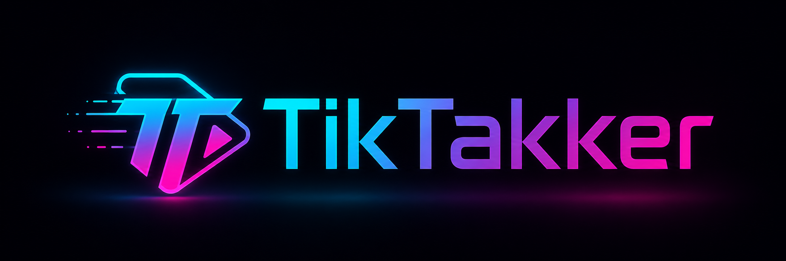

<p align="center">
  
</p>

> TikTok Unfollow Automation — Safe, configurable, one-click unfollow tool.

---

## Features

* 🎯 **One-click unfollow** — instant, no confirmation dialog
* 📊 **Live progress panel** — drag anywhere on screen
* ⏸️ **Pause / Resume / Stop** — full control mid-session
* 🛡️ **Rate-limit protection** — detects blocks, cools down, then resumes
* ⏱️ **Hourly cap** — default 60/hr, fully adjustable
* 💾 **Session persistence** — survives page refresh and continues where you left off
* ⚙️ **Customizable settings** — delays, limits, cooldowns, and more
* 🌙 **Dark mode** — matches TikTok’s aesthetic

---

## Installation & Usage


---
## Method 1: Console Paste Full Script

1. Go to TikTok.
2. Open your Following list.
3. Press `F12`.
4. Open the **Console** tab.
5. Type:

```text
allow pasting
```

6. Press Enter.
7. Open `tiktacker.js`.
8. Click **Raw**.
9. Press `Ctrl + A`, then `Ctrl + C`.
10. Paste the full script into the console.
11. Press Enter.


---

## Default Settings

| Setting       | Default | What It Does                         |
| ------------- | ------: | ------------------------------------ |
| Max Unfollows |      80 | Stops after this many unfollows      |
| Hourly Limit  |      60 | Maximum unfollows per hour           |
| Min Delay     |  4000ms | Minimum wait before next click       |
| Max Delay     |  9000ms | Maximum wait before next click       |
| Cooldown      |  30 min | Wait time after rate limit detection |

---

## How Protection Works

| Feature              | How It Works                                                                                                                             |
| -------------------- | ---------------------------------------------------------------------------------------------------------------------------------------- |
| Rate-limit detection | After clicking **Following**, the script checks if the button changed to **Follow**. If it stays **Following**, you may be rate-limited. |
| Auto cooldown        | Waits 30 minutes, then tries again.                                                                                                      |
| Hourly cap           | Defaults to 60 unfollows per hour. Adjustable in settings.                                                                               |
| Session save         | If the page refreshes or the tab closes, re-run the script and continue where you left off.                                              |
| Pause / Resume       | Pause mid-session without losing progress.                                                                                               |

---

## Important Notice

This tool is for educational purposes only.

TikTok’s Terms of Service may prohibit automation. Tiktacker is a client-side script that simulates user actions at configurable speeds.

Use responsibly and at your own risk.

---

## Disclaimer

The developer is not responsible for account restrictions, rate limits, bans, or any other action taken by TikTok.

Use this tool carefully.
